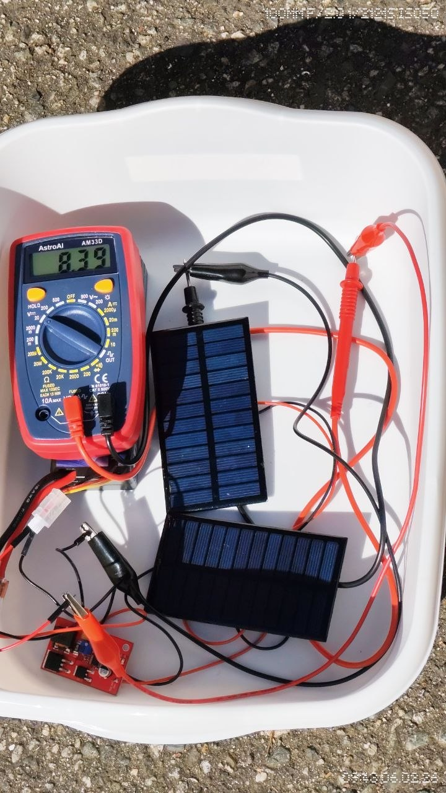

# Capstone Beta Week One Deliverable: S.O.L.A.R.

S.O.L.A.R. is my capstone project focused on building a versatile robot platform that can become self-sustaining and autonomous. The main idea is to combine robot movement, solar charging, and reinforcement learning so the robot can eventually make decisions without constant manual control.

Before Beta Week One, the robot was already able to move using manually coded controls. This week, I focused on moving the project closer to autonomy. I continued training the reinforcement learning policy, finished the solar charging circuit, and started integrating the solar panels and charging hardware onto the robot.

The solar side made good progress this week. I confirmed that the solar panels work and completed the charging circuit. I am now rebuilding the robot with the panels included, so the power system becomes part of the actual platform instead of a separate test setup.

On the software side, the recent code work supports the RL system and future solar feedback. The robot code is being set up so the host processor can access useful data like robot status, IMU data, and eventually solar panel voltage. This is important because the robot needs that information to understand how well the panels are working and make better autonomous choices.

One issue this week was that a component was fried from an earlier problem. I replaced it, so it did not become a major setback.

**Evidence:**

This photo shows the working solar panels connected to the completed charging circuit and being measured with a multimeter.

**Next steps:**

- Mount the solar panels and charging circuit onto the robot
- Add a voltage sensor for the solar panels
- Make the voltage reading accessible to the host processor
- Continue training and testing the RL policy
