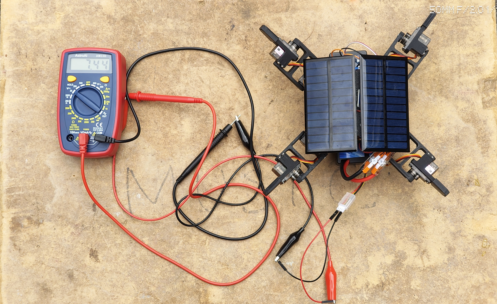
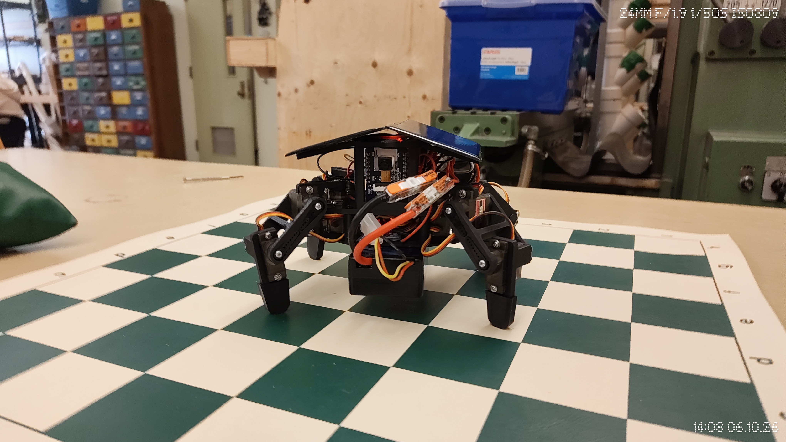

# Capstone Beta Week Two Deliverable: S.O.L.A.R.

This week, I focused on finishing the physical solar integration. I added the voltage sensor for the solar panels and finished rebuilding the robot with the solar panels and charging circuit attached. This moves the solar system from a separate test setup onto the actual robot platform.

The voltage sensor is an important step because the robot needs to know what the solar panels are producing. Once that reading is fully tested in software, it can be used as feedback for the host processor and the reinforcement learning system. This should help the robot understand when it is getting useful solar power and when it needs to adjust its behavior.

I also continued training the reinforcement learning policy. The RL work is still focused on improving the robot's autonomous movement and decision-making, while the hardware work is making the robot closer to being able to use solar feedback in the real system.

One challenge this week was making sure the rebuilt robot still had room for the panels, charging circuit, and sensor wiring. The robot is now more complete physically, but the next step is making sure the new voltage sensor data is reliable and useful in the code.

**Evidence:**

This photo shows the rebuilt robot with the solar panels attached while the voltage sensor setup is being tested with a multimeter.

This photo shows the robot rebuilt with the solar panels and charging circuit attached to the frame.

**Next steps:**

- Test and calibrate the voltage sensor reading
- Make the solar voltage reading available to the host processor
- Use the solar voltage data as feedback for the RL system
- Continue training and testing the RL policy
