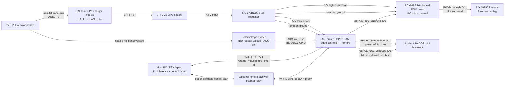

# S.O.L.A.R. Wiring Diagram

This is the current wiring draft inferred from the parts list, README, and
`firmware/solar_main/solar_main.ino`. Connections marked `TBD` need the actual
hardware choice or physical wiring confirmed before this can be treated as a
build schematic.

## System Overview



## Confirmed Controller Wiring

### ESP32-CAM to PCA9685

| ESP32-CAM | PCA9685 | Notes |
| --- | --- | --- |
| `5V` | `VCC` or board logic input | Logic power. Some PCA9685 boards also accept `VCC = 3.3 V`; confirm your board labeling. |
| `GND` | `GND` | Must share ground with BEC, servos, IMU, and ESP32. |
| `GPIO14` | `SDA` | Firmware `Wire.begin(14, 15)`. |
| `GPIO15` | `SCL` | Firmware scans PCA9685 at `0x40` on this bus. |

### PCA9685 to Servo Power

| Power source | PCA9685 terminal | Notes |
| --- | --- | --- |
| BEC `+5 V` | `V+` / servo power terminal | Feeds MG90S servo red wires. Size wiring for high current. |
| BEC `GND` | `GND` / servo power terminal | Same ground as ESP32. |
| ESP32 logic power | `VCC` | Do not rely on the ESP32 regulator to power servos. |

## Servo Channel Map

The firmware drives PCA9685 channels `0` through `11` for the 12 leg servos.
Channels `12` through `15` are currently unused.

| Leg | PCA9685 channels | Joint order |
| --- | --- | --- |
| Front left `FL` | `0`, `1`, `2` | hip, knee, foot |
| Front right `FR` | `3`, `4`, `5` | hip, knee, foot |
| Back left `BL` | `6`, `7`, `8` | hip, knee, foot |
| Back right `BR` | `9`, `10`, `11` | hip, knee, foot |

Need to confirm: the firmware's active `applyLegSets()` defaults map `BL` to
channels `6-8` and `BR` to `9-11`, but an older offset comment labels those two
groups in the opposite order. Use the active map above unless the physical robot
is already wired differently.

## IMU Wiring

The firmware can scan two I2C buses and selects whichever bus has the best IMU
match.

### Preferred IMU Bus

| ESP32-CAM | IMU | Notes |
| --- | --- | --- |
| `3.3V` or `5V` | `VIN` / `VCC` | Adafruit 10-DOF breakout; use the board's labeled power input. |
| `GND` | `GND` | Common ground. |
| `GPIO13` | `SDA` | Firmware `Wire1.begin(13, 2)`. |
| `GPIO2` | `SCL` | Boot-sensitive pin; avoid pulling it into a bad boot state. |

### Fallback Shared IMU Bus

| ESP32-CAM | IMU | Notes |
| --- | --- | --- |
| `GPIO14` | `SDA` | Shared with PCA9685 if used. |
| `GPIO15` | `SCL` | Shared with PCA9685 if used. |

Supported/recognized addresses in firmware include `MPU6050`/compatible at
`0x68` or `0x69`, `LSM303D` at `0x1D` or `0x1E`, `LSM303DLHC` accel at `0x19`,
`L3GD20H` at `0x6A` or `0x6B`, and `BMP180` at `0x77`.

## ESP32-CAM Camera Pins

The project targets the AI-Thinker ESP32-CAM pinout:

| Camera signal | ESP32 GPIO |
| --- | --- |
| `PWDN` | `32` |
| `RESET` | `-1` |
| `XCLK` | `0` |
| `SIOD` | `26` |
| `SIOC` | `27` |
| `Y9` | `35` |
| `Y8` | `34` |
| `Y7` | `39` |
| `Y6` | `36` |
| `Y5` | `21` |
| `Y4` | `19` |
| `Y3` | `18` |
| `Y2` | `5` |
| `VSYNC` | `25` |
| `HREF` | `23` |
| `PCLK` | `22` |

These are on the ESP32-CAM camera connector, not loose wiring if the camera is
installed in the board socket.

## Solar Voltage Telemetry

Firmware support exists, but it is disabled by default:

```cpp
#define SOLAR_PANEL_ADC_PIN -1
#define SOLAR_PANEL_VOLTAGE_DIVIDER 2.0f
```

To enable telemetry, wire the combined parallel-panel positive bus at the
charger `PANEL+` input through a resistor divider into an unused ADC1-capable
ESP32 pin. This measures net solar input voltage before the charger, not battery
voltage. The ADC input must stay at or below `3.3 V`. Tie the divider ground to
robot ground. Avoid ADC2 pins while Wi-Fi is active.

Need to confirm: actual ADC pin and resistor values. On an AI-Thinker ESP32-CAM,
most ADC1 pins are already used by the camera, so the clean options are either
repurpose an exposed non-camera ADC1 pin if available on your board, or add a
small I2C ADC module on the existing `GPIO14/GPIO15` I2C bus.

## Power Wiring Draft

| Source | Destination | Status |
| --- | --- | --- |
| Solar panels wired in parallel | Solar charger `PANEL+` / `PANEL-` | Confirmed by user; charger input rating still unknown. |
| Solar charger `BATT+` / `BATT-` | 2S LiPo | Confirmed by user as a 2S-compatible charger module. |
| 2S LiPo | 5 V 5 A BEC input | Confirmed from parts, physical connector TBD. |
| BEC 5 V output | PCA9685 servo `V+` | Required for servo power. |
| BEC 5 V output | ESP32-CAM `5V` | Confirmed by user. |
| BEC/servo ground | ESP32-CAM, PCA9685, IMU, voltage divider | Required common ground. |

Add a physical power switch and fuse/polyfuse if they are present; neither is
currently documented in the repo.

## Unknown Components To Confirm

1. Solar charger module details: max panel input voltage/current and max charge
   current.
2. Battery connector and protection: pack connector type, BMS/protection status,
   fuse/switch location, and whether the charger and BEC are both tied directly
   to the battery.
3. PCA9685 board details: whether `VCC` should be `3.3 V` or `5 V` on your exact
   breakout, and whether `V+` terminal is separate from logic `VCC`.
4. IMU bus: whether the Adafruit 10-DOF is wired on `GPIO13/GPIO2` or shared
   `GPIO14/GPIO15`.
5. Servo physical labels: rear-left `6-8` and rear-right `9-11` are treated as
   likely correct, but should be verified on the physical robot.
6. Solar telemetry ADC path: choose an available ESP32 ADC1 pin or add an I2C
   ADC module, then choose resistor divider values for measuring net panel
   voltage at the charger `PANEL+` input.
