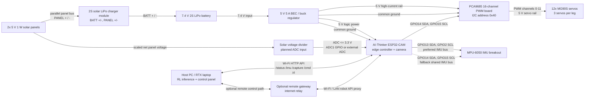

# S.O.L.A.R. Wiring Diagram

This wiring reference is derived from the parts list, README, and
`firmware/solar_main/solar_main.ino`. It documents the prototype wiring and the
remaining hardware interfaces that are still planned.

## System Overview



## Confirmed Controller Wiring

### ESP32-CAM to PCA9685

| ESP32-CAM | PCA9685 | Notes |
| --- | --- | --- |
| `5V` | `VCC` or board logic input | Logic power. Some PCA9685 boards also accept `VCC = 3.3 V`; the correct logic voltage depends on the board variant. |
| `GND` | `GND` | Must share ground with BEC, servos, IMU, and ESP32. |
| `GPIO14` | `SDA` | Firmware `Wire.begin(14, 15)`. |
| `GPIO15` | `SCL` | Firmware scans PCA9685 at `0x40` on this bus. |

### PCA9685 to Servo Power

| Power source | PCA9685 terminal | Notes |
| --- | --- | --- |
| BEC `+5 V` | `V+` / servo power terminal | Feeds MG90S servo red wires. Size wiring for high current. |
| BEC `GND` | `GND` / servo power terminal | Same ground as ESP32. |
| ESP32 logic power | `VCC` | Do not rely on the ESP32 regulator to power servos. |

## Servo Channel Map

The firmware drives PCA9685 channels `0` through `11` for the 12 leg servos.
Channels `12` through `15` are currently unused.

The physical body motor numbers keep their original body locations. The rewired
PCA9685 channel order is:

| PCA9685 channel | Body motor |
| --- | --- |
| `0` | `M12` |
| `1` | `M11` |
| `2` | `M10` |
| `3` | `M9` |
| `4` | `M6` |
| `5` | `M3` |
| `6` | `M7` |
| `7` | `M8` |
| `8` | `M1` |
| `9` | `M4` |
| `10` | `M5` |
| `11` | `M2` |

The firmware keeps calibration offsets, leg sets, and `/test?motor=` ids keyed
to logical body motors. It translates those body motor ids to the PCA9685
channels above when writing PWM output. This motor map has been tested on the
physical robot, and walking from the control panel is confirmed.

| Leg | Logical body motors | Joint order |
| --- | --- | --- |
| Front left `FL` | `M1`, `M2`, `M3` | hip, knee, foot |
| Front right `FR` | `M4`, `M5`, `M6` | hip, knee, foot |
| Back left `BL` | `M7`, `M8`, `M9` | hip, knee, foot |
| Back right `BR` | `M10`, `M11`, `M12` | hip, knee, foot |

## IMU Wiring

The firmware can scan two I2C buses and selects whichever bus has the best IMU
match.

### Preferred IMU Bus

| ESP32-CAM | IMU | Notes |
| --- | --- | --- |
| `3.3V` or `5V` | `VIN` / `VCC` | MPU-6050 breakout; use the board's labeled power input. |
| `GND` | `GND` | Common ground. |
| `GPIO13` | `SDA` | Firmware `Wire1.begin(13, 2)`. |
| `GPIO2` | `SCL` | Boot-sensitive pin; avoid pulling it into a bad boot state. |

### Fallback Shared IMU Bus

| ESP32-CAM | IMU | Notes |
| --- | --- | --- |
| `GPIO14` | `SDA` | Shared with PCA9685 if used. |
| `GPIO15` | `SCL` | Shared with PCA9685 if used. |

Supported/recognized IMU addresses in firmware are `MPU6050`/compatible at
`0x68` or `0x69`. The firmware uses the MPU-6050 accelerometer and gyroscope
only; magnetometer, compass heading, barometer, pressure, and altitude telemetry
are no longer part of the robot API.

## ESP32-CAM Camera Pins

The project targets the AI-Thinker ESP32-CAM pinout:

| Camera signal | ESP32 GPIO |
| --- | --- |
| `PWDN` | `32` |
| `RESET` | `-1` |
| `XCLK` | `0` |
| `SIOD` | `26` |
| `SIOC` | `27` |
| `Y9` | `35` |
| `Y8` | `34` |
| `Y7` | `39` |
| `Y6` | `36` |
| `Y5` | `21` |
| `Y4` | `19` |
| `Y3` | `18` |
| `Y2` | `5` |
| `VSYNC` | `25` |
| `HREF` | `23` |
| `PCLK` | `22` |

These are on the ESP32-CAM camera connector, not loose wiring if the camera is
installed in the board socket.

## Solar Voltage Telemetry

Firmware support exists, but panel-voltage telemetry is disabled by default:

```cpp
#define SOLAR_PANEL_ADC_PIN -1
#define SOLAR_PANEL_VOLTAGE_DIVIDER 2.0f
```

The intended measurement point is the combined parallel-panel positive bus at
the charger `PANEL+` input, routed through a resistor divider into an
ADC-capable input. This measures net solar input voltage before the charger, not
battery voltage. The ADC input must stay at or below `3.3 V`, and the divider
ground must tie to robot ground. ADC2 pins are avoided while Wi-Fi is active.

On an AI-Thinker ESP32-CAM, most ADC1 pins are already used by the camera. The
clean hardware options are an exposed non-camera ADC1 pin or a small I2C ADC
module on the existing `GPIO14/GPIO15` I2C bus.

## Power Wiring Draft

| Source | Destination | Status |
| --- | --- | --- |
| Solar panels wired in parallel | Solar charger `PANEL+` / `PANEL-` | Prototype panel bus. |
| Solar charger `BATT+` / `BATT-` | 2S LiPo | 2S-compatible charger module. |
| 2S LiPo | 5 V 5 A BEC input | Prototype battery-to-regulator path. |
| BEC 5 V output | PCA9685 servo `V+` | Required for servo power. |
| BEC 5 V output | ESP32-CAM `5V` | Prototype controller power path. |
| BEC/servo ground | ESP32-CAM, PCA9685, IMU, voltage divider | Required common ground. |

A physical power switch and fuse/polyfuse are not currently documented in the
repo.
